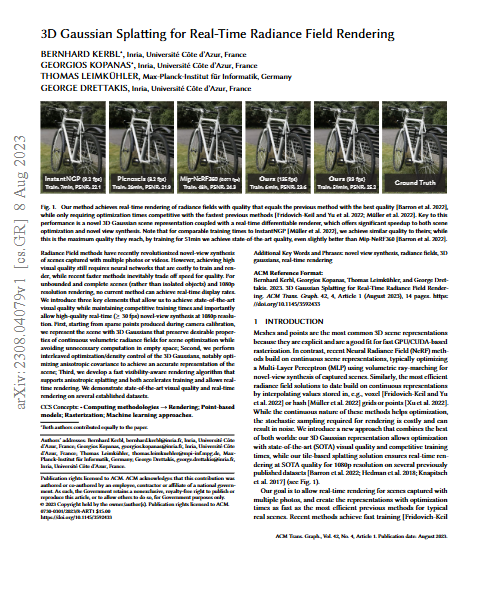
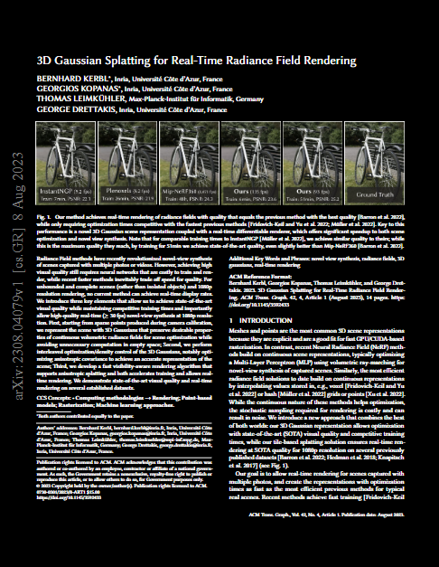
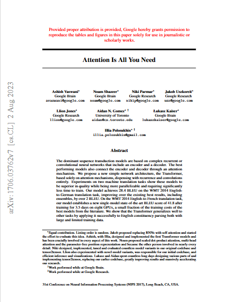
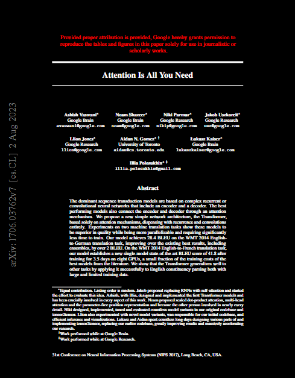

# PDF Dark Mode Converter

논문 PDF를 다크모드로 변환하는 python code 입니다.
**Docling (CUDA)** 으로 피규어 영역을 자동 감지하여, 피규어는 원본 색상 그대로 보존하고 나머지(텍스트·배경·벡터)만 다크모드로 변환하였습니다.

---

### 3D Gaussian Splatting

| Light Mode | Dark Mode |
|:---:|:---:|
|  |  |

### Attention Is All You Need (Transformer)

| Light Mode | Dark Mode |
|:---:|:---:|
|  |  |

---

## 동작 방식

```
1. Docling (CUDA) → 논문 내 피규어 바운딩박스 추출
2. 피규어 영역을 원본 픽스맵으로 스냅샷 저장
3. 전체 PDF에 다크모드 적용 (검은 배경, 흰 텍스트, 벡터 반전)
4. 피규어 영역에 저장해둔 원본 스냅샷 복원
5. 결과 PDF 저장
```

---

## 요구사항

- Python 3.10 이상
- NVIDIA GPU (CUDA 지원)
- CUDA Toolkit 12.x 및 cuDNN 설치

---

## 설치

### 1. 저장소 클론

```bash
git clone https://github.com/YeonUk-Kim0120/paper-darkmode-converter.git
cd parser
```

### 2. 패키지 설치

```bash
pip install pymupdf docling numpy
```

### 3. PyTorch CUDA 버전 설치

> `pip install torch`만 하면 **CPU 전용 버전**이 설치되어 CUDA가 동작하지 않습니다.  
> 반드시 아래 명령으로 CUDA 지원 버전을 별도로 설치 필요.

```bash
# CUDA 12.8용 (RTX 20xx / 30xx / 40xx 시리즈)
pip install torch torchvision torchaudio --index-url https://download.pytorch.org/whl/cu128
```

### 4. Docling AI 모델 가중치 다운로드

Docling은 **최초 실행 시** 피규어 감지에 필요한 AI 모델 가중치를 자동으로 다운로드.

- 다운로드 경로: `~/.cache/docling/` (Windows: `C:\Users\{사용자}\.cache\docling\`)
- 용량: 약 1~2 GB
- 인터넷 연결 필요, 최초 1회만 다운로드 (이후 캐시 재사용)

별도로 미리 받고 싶다면 아래 명령으로 실행 전에 트리거할 수 있습니다:

```bash
python -c "from docling.document_converter import DocumentConverter; DocumentConverter()"
```

---

## 사용법

### 기본 실행

```bash
# paper.pdf → paper_dark.pdf (자동 네이밍)
python model.py paper.pdf
```

### 입출력 파일 모두 지정

```bash
python model.py input.pdf output.pdf
```


## 주의사항

- **피규어 화질**: `SNAP_DPI`를 `300~400`으로 올리면 확대 시에도 선명하게 보입니다.
- **변환 시간**: 논문 1편 기준 GPU 환경에서 최대 1~5분 소요.
